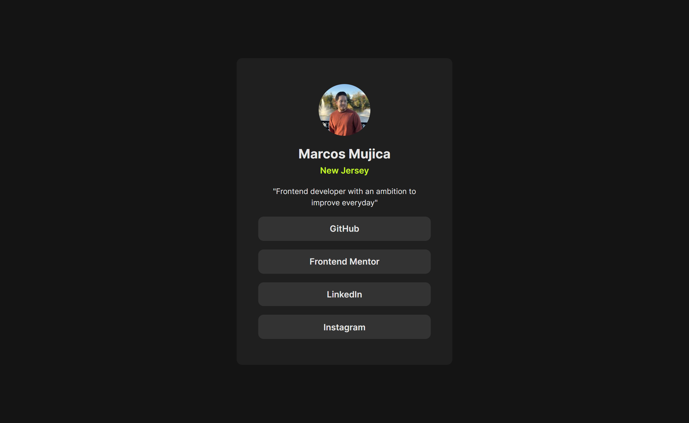

# Frontend Mentor - Social links profile solution

This is a solution to the [Social links profile challenge on Frontend Mentor](https://www.frontendmentor.io/challenges/social-links-profile-UG32l9m6dQ). Frontend Mentor challenges help you improve your coding skills by building realistic projects.

## Table of contents

- [Overview](#overview)
  - [The challenge](#the-challenge)
  - [Screenshot](#screenshot)
  - [Links](#links)
- [My process](#my-process)
  - [Built with](#built-with)
  - [Useful resources](#useful-resources)
- [Author](#author)
- [Acknowledgments](#acknowledgments)

## Overview

### The challenge

Users should be able to:

- See hover and focus states for all interactive elements on the page

### Screenshot

### Links

- Solution URL: [View Code](https://github.com/moojica/frontend-mentor-social-links-profile)
- Live Site URL: [View Site](https://moojica.github.io/frontend-mentor-social-links-profile/)

## My process

### Built with

- Semantic HTML5 markup
- CSS custom properties
- Flexbox

### Useful resources

- [CSS Reset](https://www.joshwcomeau.com/css/custom-css-reset/) - This helped me reset the CSS styling browsers add by default with a bit of customization by Josh Comeau. I really liked this pattern and will use it going forward.

## Author

- Website - [Add your name here](https://www.your-site.com)
- Frontend Mentor - [@moojica](https://www.frontendmentor.io/profile/moojica)

## Acknowledgments

Shoutout to [Josh Comeau](https://www.joshwcomeau.com/css/custom-css-reset/) for the CSS reset!
